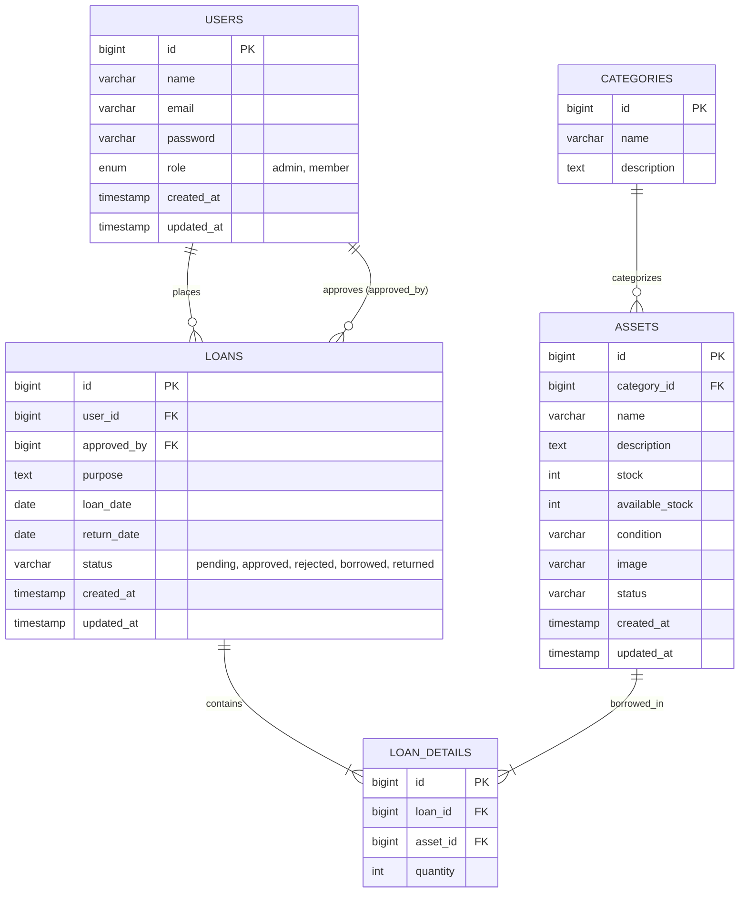

# DESIGN.md - SIAP-HIMAKOM

Sistem Informasi Aset dan Peminjaman HIMAKOM (SIAP-HIMAKOM) Berbasis Web.

---

## 1. Arsitektur & Teknologi Utama
*   **Backend Framework**: PHP 8.5+ with CodeIgniter 4.7
*   **Database**: MySQL
*   **Frontend Libraries**:
    *   Bootstrap 5 (packaged inside templates)
    *   FlexStart Template (Public Landing Page)
    *   AdminLTE 4 (Dashboard Page Layout)
    *   jQuery & jQuery DataTables
    *   Hermawan DataTables (Server-side handling in CodeIgniter 4)
    *   Chart.js (Admin Dashboard visualization graphs)

---

## 2. Struktur Database & Relasi

---

## 3. Skema Navigasi & Tampilan Visual

### A. Palet Warna & Identitas Visual
*   **HIMAKOM Identity Color**: Sleek dark mode / deep blue (`#0c2540` / HSL 210, 68%, 15%) as primary, accented with warm gold/amber (`#f1b24a`) for alerts/actions, matching the HIMAKOM Logo logo.
*   **Logo HIMAKOM**: Placed on the landing page navbar and the top-left sidebar/navbar of AdminLTE dashboard.
*   **University Identity**: Showcase Program Studi Ilmu Komputer Universitas Lambung Mangkurat (ULM) with clean modern fonts (Roboto, Poppins).

### B. Landing Page (FlexStart Layout)
*   **Hero Section**: Intro to SIAP-HIMAKOM.
*   **Tentang HIMAKOM**: Description of the organization.
*   **Visi & Misi Prodi Ilmu Komputer ULM**:
    *   *Visi*: Terwujudnya program studi bidang komputasi yang mampu bersaing secara nasional dalam otomasi data untuk mengoptimalkan potensi daerah serta mendukung e-government dengan teknologi kekinian.
    *   *Misi*:
        1. Menyelenggarakan pendidikan dan pengajaran sesuai dengan kualifikasi nasional dibidang komputer dalam otomasi data dalam rangka mencerdaskan masyarakat dan bersaing secara nasional.
        2. Menghasilkan dan mengembangkan penelitian keilmuan bidang komputasi dengan teknologi kekinian sebagai penelitian yang dapat mengoptimalkan potensi daerah serta mendukung e-government.
        3. Berpartisipasi dalam pengabdian masyarakat untuk meningkatkan potensi daerah dan menyelesaikan masalah daerah dengan teknologi berbasis komputer.
    *   *Web Utama*: Direct links to [ilkom.ulm.ac.id](https://ilkom.ulm.ac.id).
*   **Katalog Aset (Public)**: Interactive cards showing asset photo, name, category, condition, and available stock.
*   **FAQ & Kontak**: standard info.

### C. Dashboard Layout (AdminLTE 4)
*   **Admin Dashboard**: Statistical summaries and dynamic Chart.js dashboards.
*   **Member Dashboard**: Summary of bookings, quick access to catalog.
*   **DataTables Grid**: Applied on Users, Categories, Assets, and Loans tables with server-side processing for instant AJAX searching, sorting, and pagination.

---

## 4. Role Based Access Control (RBAC)

| Fitur | Guest | Member | Admin |
| :--- | :---: | :---: | :---: |
| Landing Page, FAQ, Kontak | V | V | V |
| Melihat Katalog & Detail Aset | V | V | V |
| Registrasi & Login | V | V | V |
| Mengubah Profil Akun | - | V | V |
| Mengajukan Peminjaman | - | V | - |
| Melihat Status & Riwayat Pinjam | - | V | V |
| Manajemen Kategori (CRUD) | - | - | V |
| Manajemen Aset & Stok (CRUD) | - | - | V |
| Manajemen Pengguna & Roles (CRUD)| - | - | V |
| Verifikasi Peminjaman (Approve/Reject) | - | - | V |
| Dashboard Statistik & Chart.js | - | - | V |
