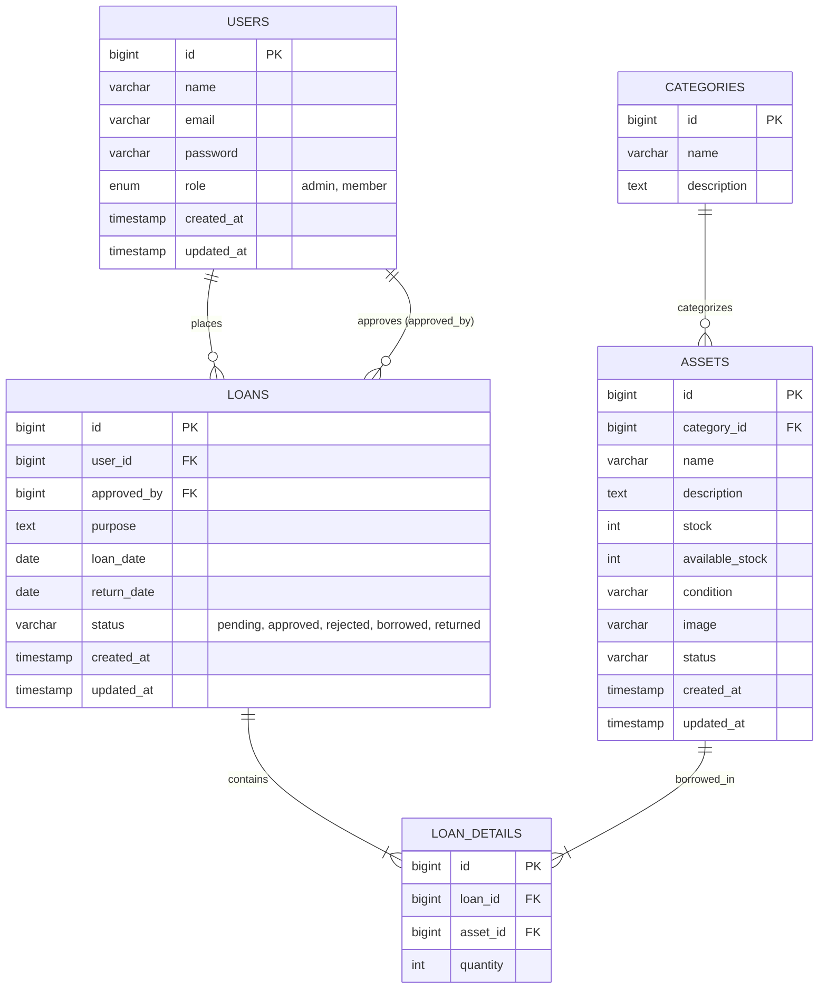

# DESIGN.md - SIAP-HIMAKOM

Sistem Informasi Aset dan Peminjaman HIMAKOM (SIAP-HIMAKOM) Berbasis Web.

---

## 1. Arsitektur & Teknologi Utama
*   **Backend Framework**: PHP 8.5+ with CodeIgniter 4.7
*   **Database**: MySQL
*   **Frontend Libraries**:
    *   Bootstrap 5 (packaged inside templates)
    *   FlexStart Template (Public Landing Page)
    *   AdminLTE 4 (Dashboard Page Layout)
    *   jQuery & jQuery DataTables
    *   Hermawan DataTables (Server-side handling in CodeIgniter 4)
    *   Chart.js (Admin Dashboard visualization graphs)

---

## 2. Struktur Database & Relasi

---

## 3. Skema Navigasi & Tampilan Visual

### A. Palet Warna & Identitas Visual
*   **Warna Utama (Primary)**: Deep Navy Blue (`#0d3c78`) untuk header, sidebar menu, dan tombol utama.
*   **Warna Aksen / Secondary**: Muted Steel Blue (`#567c9c`) untuk penanda aktif, link, dan penekanan sekunder.
*   **Warna Latar Belakang (Base Background)**: Gray-White (`#f0f2f5`) untuk body latar belakang halaman admin, login, register, dan konten.
*   **Warna Teks Utama**: Slate Gray (`#595959`) untuk subteks, deskripsi, dan teks sekunder.
*   **Tipografi (Font)**: Menggunakan font **Montserrat** di seluruh bagian situs (landing page, auth pages, dan dashboard) untuk menyelaraskan identitas visual dengan situs resmi Program Studi Ilmu Komputer ULM.
*   **Ikon Sistem**: Menggunakan **Bootstrap Icons v1.11.1** via CDN untuk rendering ikon vector yang bersih dan responsif.
*   **Logo HIMAKOM**: Ditempatkan pada navbar halaman beranda publik dan sidebar kiri atas dashboard AdminLTE.
*   **University Identity**: Menampilkan identitas Program Studi Ilmu Komputer Universitas Lambung Mangkurat (ULM) dengan tautan langsung ke [ilkom.ulm.ac.id](https://ilkom.ulm.ac.id).

### B. Landing Page (FlexStart Layout)
*   **Hero Section**: Intro to SIAP-HIMAKOM.
*   **Tentang HIMAKOM & Prodi**: Ditampilkan dalam 2 buah kotak kartu putih minimalis sejajar yang memiliki tinggi sama (*equal height*).
*   **Visi & Misi Prodi Ilmu Komputer ULM**: Ditampilkan terintegrasi di kartu sebelah kanan.
*   **Tautan Web Resmi**: Dipisahkan di bagian bawah kedua kartu secara terpusat (*centered layout*).
*   **Katalog Aset (Public)**: Kartu interaktif yang menampilkan foto aset, nama, kategori, kondisi (dengan badge dinamis: Hijau untuk Sangat Baik, Kuning untuk Baik, Merah untuk Buruk/Rusak), dan stok tersedia.
*   **FAQ & Kontak**: Info tanya jawab seputar peminjaman dan kontak sekretariat HIMAKOM.

### C. Dashboard Layout (AdminLTE 4)
*   **Admin Dashboard**: Ringkasan statistik berbentuk 4 kartu solid AdminLTE yang disesuaikan dengan mood warna web (Biru Tua untuk Total Peminjaman, Hijau Toska untuk Aset Tersedia, Kuning Emas untuk Registrasi Member, Merah Muted untuk Peminjaman Aktif) dalam bahasa Indonesia dengan link detail di bagian bawah, serta grafik Chart.js dinamis.
*   **Menu Navigasi Sidebar**: Menyembunyikan seluruh garis pembatas (border) agar bersih. Tombol keluar disesuaikan lebih rapat.
*   **Menu Dropdown Profil**: Hanya menyediakan tombol "Keluar" berukuran penuh (full width).
*   **Member Dashboard**: Summary of bookings, quick access to catalog.
*   **DataTables Grid**: Applied on Users, Categories, Assets, and Loans tables with server-side processing for instant AJAX searching, sorting, and pagination. Warna kondisi aset disesuaikan (Sangat Baik: Hijau, Baik: Kuning, Buruk: Merah).
*   **Confirmation Modals**: Semua dialog konfirmasi aksi (Approve, Reject, Borrow, Return di halaman Peminjaman) menggunakan Bootstrap Modal custom yang centered, dengan ikon bertema warna (Hijau untuk Setujui/Kembalikan, Merah untuk Tolak, Biru Tua untuk Tandai Diambil), judul bold, deskripsi kontekstual, serta dua tombol aksi (Batal & konfirmasi). Menggantikan dialog `confirm()` bawaan browser.
*   **Toast Notifications**: Feedback aksi sukses/error menggunakan Bootstrap Toast berwarna (Hijau untuk sukses, Merah untuk error) di pojok kanan atas dengan auto-dismiss 4 detik. Menggantikan dialog `alert()` bawaan browser.

---

## 4. Role Based Access Control (RBAC)

| Fitur | Guest | Member | Admin |
| :--- | :---: | :---: | :---: |
| Landing Page, FAQ, Kontak | V | V | V |
| Melihat Katalog & Detail Aset | V | V | V |
| Registrasi & Login | V | V | V |
| Mengubah Profil Akun | - | V | V |
| Mengajukan Peminjaman | - | V | - |
| Melihat Status & Riwayat Pinjam | - | V | V |
| Manajemen Kategori (CRUD) | - | - | V |
| Manajemen Aset & Stok (CRUD) | - | - | V |
| Manajemen Pengguna & Roles (CRUD)| - | - | V |
| Verifikasi Peminjaman (Approve/Reject) | - | - | V |
| Dashboard Statistik & Chart.js | - | - | V |
